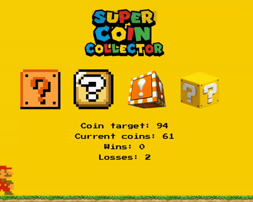

# super-coin-collector
The boot camp challenge was to build a simple game using the Math.random() function. Instead, I practiced not only Math.random(), but also mouse-controlled animation, boundary boxes, collision detection algorithms, and sound design. The result is a tribute to Nintendo's most iconic character. Designed for desktop.

# tech
jQuery, jQuery UI, HTML, CSS, JS

# try it yourself!
https://jwkeena.github.io/super-coin-collector/

